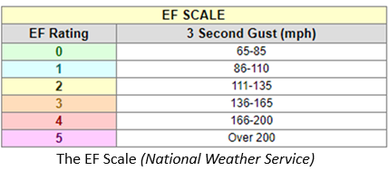

```{r setup, include=FALSE}
knitr::opts_chunk$set(echo = FALSE)

library(tidyverse)
library(stringr)
library(tmap)
library(ggplot2)
library(usmap)
library(showtext)
library(plotly)
library(leaflet)
library(dplyr)
library(sf)
library(maps)
library(ggplot2)
library(patchwork)


```

## Introduction

-   A tornado is a rapidly rotating column of air that extends from a thunderstorm to the ground, forming a funnel-shaped cloud, known as a tornado vortex.

Here are the goals of the data explore:

-   Data Analysis: Cleaning and Pre-processing.

-   Tornado Trends and Patterns: Frequencies & intense over time, Investigate regional variations.

-   Tornado Impact Assessment: Assess the economic and human impact of tornadoes focusing on the geographical areas.

-   Develop Shiny Application: Tornadoes in the United States.


## 1. Explore the Tornado Dataset

-   It is sourced from NOAA's National Weather Service Storm Prediction Center Severe Weather Maps, Graphics and Data Page.

-   The data offers insights into the characteristics and impacts of tornadoes that have occurred from 1950 to 2022.

### Data Cleaning and Pre-processing

### Step I. Identify the data information

-   The "tornado" data set has 29 variables and 68,701 observations.

```{r, echo = F,message = F, warning = F}
library(tidyverse)
library(knitr)


data_discription <- data.frame(
  Name = c("Tornado Number (om)","Year (yr)","Month (mo)","Day of the Month (dy)","Date","Time",
           "Timezone (tz)","State(st)","State FIPS Number (stf)","Magnitude (mag)","Injuries (inj)","Fatalities (fat)",
           "Loss (loss)",
           "Starting Latitude (slat)",
           "Starting Longitude (slon)",
           "Ending Latitude (elat)",
           "Ending Longitude (elon)",
           "Length (len)","Width (wid)","Number of States Affected (ns)",
           "State Number (sn)","FIPS Codes for Counties (f1, f2, f3, f4)","Was the Magnitude Estimated (fc)"),
  Description = c("An identifier for each tornado within a specific year",
                  "The year in which the tornado occurred",
                  "The month of the tornado occurrence",
                  "The specific day of the month when the tornado struck",
                  "The date of the tornado occurrence",
                  "The time of day when the tornado was reported",
                  "The timezone, using the canonical tz database",
                  "Affected State",
                  "The State FIPS (Federal Information Processing Standards) number.",
                  "The magnitude of the tornado, recorded on the F scale. EF scale from 2007. Some are estimated",
                  "The number of injuries associated with the tornado",
                  "The number of fatalities caused by the tornado",
                  "Estimated property loss information, with values grouped into ranges for years before 1996",
                  "The geographical coordinates of the tornado's starting point. (Starting latitude )",
                  "The geographical coordinates of the tornado's starting point. (Starting longitude)",
                  "The geographical coordinates of the tornado's endpoint. (Ending latitude)",
                  "The geographical coordinates of the tornado's endpoint. (Ending longitude)",
                  "The length of the tornado's path",
                  "The width of the tornado's path",
                  "The number of states impacted by the tornado",
                  "The state no of the row",
                  "FIPS codes for up to four counties affected by the tornado",
                  "A logical variable indicating whether the magnitude value was estimated"),

  Type = c("Integer","Integer","Integer","Integer","categorical","categorical","Integer","categorical",
           "Integer","Integer","Integer","Integer","numeric","numeric","numeric","numeric","numeric","numeric",
           "Integer","Integer","Integer","Integer","Integer"),

  Units = c("", "", "", "", "MMDYYYY","HHMMSS","","","","","","","In dollars","Degrees","Degrees","Degrees","Degrees",
            "In miles","In yards","","","",""),

  RangeValues = c("","1950 - 2022","1 to 12","1 to 31","","","","A two-letter postal abbreviation representing the affected state. (DC=Washington,DC;PR=Puerto Rico,VI=Virgin Islands)",
                      "","","","","Prior to 1996, values were grouped into ranges. The reported number for such years is the maximum of its range",
                      "","","","","",""," 1, 2, or 3..","Indicates whether the row contains the entire track information for a state (1) or if there is at least one more entry for the state for that tornado (0)",
                      "","1 or 0")
)

kable(data_discription)

```

## 1. Explore the Tornado Dataset..cont

### Step II. Check for missing values in the data set

```{r,echo=FALSE,warning=FALSE,message=FALSE}
library(tidyverse)

#read the data

tornado <-read.csv("https://www.spc.noaa.gov/wcm/data/1950-2022_actual_tornadoes.csv")
missing_values <- colSums(is.na(tornado))

print(missing_values)

```

-   Output indicates that there are no missing values.

### Step III. Identify and Handling Inconsistent Values

-   Get the summary and Identify issues/considerations

```{r,echo=FALSE,warning=FALSE,message=FALSE}
summary(tornado)
```

## 1. Explore the Tornado Dataset..cont

### Issues/considerations

1.  "mag" (Magnitude) Column:

-   The minimum value is -9, which may be inconsistent since magnitude is typically a non-negative value.

**Identify rows which have negative magnitude.**

```{r,echo=FALSE,warning=FALSE,message=FALSE}
# Identify rows where magnitude is negative
library(tidyverse)

#read the data

tornado <-read.csv("https://www.spc.noaa.gov/wcm/data/1950-2022_actual_tornadoes.csv")
negative_mag_rows <- tornado[tornado$mag < 0, ] 
mag_neg<-(negative_mag_rows[, c("om", "yr", "mo", "dy", "mag","fc")])


num_rows <- nrow(mag_neg)

print(paste('No of rows where magnitude is negative:', num_rows))


```

**Identify years where magnitude is negative.**

```{r,echo=FALSE,warning=FALSE,message=FALSE}
print(unique(negative_mag_rows$yr))

```

-   These rows seem to represent tornadoes from year 2016-2022 where the original magnitude ("mag") is listed as -9, and the "fc" value is set to 0, according to the modification scheme indicating that no modification was made for these tornadoes. ([Noaa](https://www.spc.noaa.gov/wcm/#data)) / [Info](https://www.spc.noaa.gov/wcm/OneTor_F-scale-modifications.pdf).

## 1. Explore the Tornado Dataset..cont

2.  "date" and "time" Columns:

-   Confirm that the "date" and "time" columns are correctly formatted as dates and times, respectively. (Date format="%Y-%m-%d", Time format="%H:%M:%S")

```{r,echo=FALSE,warning=FALSE,message=FALSE}
# Convert "date" to Date class
tornado$date <- as.Date(tornado$date, format="%Y-%m-%d")

# Convert "time" to POSIXct class
tornado$time <- as.POSIXct(tornado$time, format="%H:%M:%S")
head(tornado$time)

```

3.  "st" Column:

-   Create a separate column called "state_full" which have the full state name.

```{r,echo=FALSE,warning=FALSE,message=FALSE}

# Create a mapping between state abbreviations and full names
state_mapping <- c("AL" = "Alabama", "AK" = "Alaska", "AZ" = "Arizona", "AR" = "Arkansas", "CA" = "California",
                   "CO" = "Colorado", "CT" = "Connecticut", "DE" = "Delaware", "FL" = "Florida", "GA" = "Georgia",
                   "HI" = "Hawaii", "ID" = "Idaho", "IL" = "Illinois", "IN" = "Indiana", "IA" = "Iowa",
                   "KS" = "Kansas", "KY" = "Kentucky", "LA" = "Louisiana", "ME" = "Maine", "MD" = "Maryland",
                   "MA" = "Massachusetts", "MI" = "Michigan", "MN" = "Minnesota", "MS" = "Mississippi", "MO" = "Missouri",
                   "MT" = "Montana", "NE" = "Nebraska", "NV" = "Nevada", "NH" = "New Hampshire", "NJ" = "New Jersey",
                   "NM" = "New Mexico", "NY" = "New York", "NC" = "North Carolina", "ND" = "North Dakota", "OH" = "Ohio",
                   "OK" = "Oklahoma", "OR" = "Oregon", "PA" = "Pennsylvania", "RI" = "Rhode Island", "SC" = "South Carolina",
                   "SD" = "South Dakota", "TN" = "Tennessee", "TX" = "Texas", "UT" = "Utah", "VT" = "Vermont",
                   "VA" = "Virginia", "WA" = "Washington", "WV" = "West Virginia", "WI" = "Wisconsin", "WY" = "Wyoming")

# Add a new column with full state names
tornado$state_full <- state_mapping[tornado$st]

# Print the first few rows to verify
head(tornado[, c("st", "state_full")])

```


## 2. Tornado Trends and Patterns

### 2.1 Are tornadoes becoming more frequent or intense over time?

1. A line plot for tornado frequency Over the time:

- The variables: year (`yr`), month (`mo`), magnitude (`mag`), and other relevant variables.


::: columns

:::: column

```{r, echo=FALSE, warning=FALSE, message=FALSE, fig.width=7, fig.height=5}

tornado_subset <- tornado[, c("yr", "mo", "mag")]
tornado_frequency <- aggregate(mag ~ yr, data = tornado_subset, FUN = length)
trend_frequency <- lm(mag ~ yr, data = tornado_frequency)

# Plot tornado frequency over time with trend lines
plot(tornado_frequency$yr, tornado_frequency$mag, type = "l", xlab = "Year", ylab = "Tornado Frequency", main = "Tornado Frequency Over Time with Trend Line")
abline(trend_frequency, col = "red")

```

::::


:::: column
- The increasing trend in tornado frequency from 1950 to 2022.
- The pattern (zig-zag)indicate some variability in tornado frequency from year to year.

::::

:::

 


## 2. Tornado Trends and Patterns cont..

### 2.2 Investigate seasonal and regional variations in tornado occurrences.

- variables: latitude (`slat` and `elat`), longitude (`slon` and `elon`), and the month of occurrence (`mo`).

1. An Interactive line plot for monthly tornado variation


::: columns

:::: column


```{r, echo=FALSE, warning=FALSE, message=FALSE,fig.width=7, fig.height=5}

library(dplyr)
library(plotly)


tornado_map_data <- tornado[, c("slat", "slon", "elat", "elon", "mo","st")]

tornado$mo <- factor(tornado$mo, levels = 1:12, labels = month.abb)


tornado_monthly_counts  <- tornado_map_data %>%
  group_by(mo) %>%
  summarise(total_tornadoes = n())

tornado_state_counts  <- tornado_map_data  %>%
  group_by(st) %>%
  summarise(total_tornadoes = n())%>%
   arrange(desc( total_tornadoes))

plot_ly(data = tornado_monthly_counts , x = ~mo, y = ~total_tornadoes, type = "scatter", mode = "lines+markers", 
        name = "Tornado Count", line = list(color = "blue")) %>%
  layout(title = "Tornado Occurrences by Month",
         xaxis = list(title = "Month", tickmode = "array", tickvals = 1:12, ticktext =month.name),
         yaxis = list(title = "Tornado Count"))
```

::::


:::: column
- Tornado occurrences peak in April and May (mo = 4, 5), with the highest activity, gradually declining from June to December, and exhibiting a substantial increase in March (mo = 3), reflecting seasonal patterns and weather conditions.

::::

:::


## 2. Tornado Trends and Patterns cont..

2. An Interactive map to visualize state-wise tornado count


::: columns

:::: column


```{r, echo=FALSE, warning=FALSE, message=FALSE, fig.width=7, fig.height=6}
library(leaflet)
library(dplyr)
library(sf)
library(usmap)
library(maps)

# Create a summary data frame with tornado counts by state
tornado_counts <- tornado %>%
  group_by(state_full) %>%
  summarise(tornado_count = n())

# Load a data frame mapping state names to state abbreviations
state_abbreviations <- data.frame(
  state_full = state.name,
  state_abbr = state.abb
)

# Merge tornado counts with state abbreviations
tornado_counts <- merge(tornado_counts, state_abbreviations, by = "state_full")

# Load U.S. state map data
us_states <- st_as_sf(map("state", plot = FALSE, fill = TRUE))

# Check and fix invalid geometries
us_states1 <- st_make_valid(us_states)
# Convert 'ID' column in 'us_states1' to lowercase
us_states1$ID <- tolower(us_states1$ID)

# Convert 'state_full' column in 'tornado_counts' to lowercase
tornado_counts$state_full <- tolower(tornado_counts$state_full)

# Merge tornado counts with U.S. state map (case-insensitive)
us_states <- merge(us_states1, tornado_counts, by.x = "ID", by.y = "state_full", all.x = TRUE)


# Create an interactive map
# Create an interactive map with a different fill color
leaflet(data = us_states) %>%
  addProviderTiles("CartoDB.Voyager") %>%
  addPolygons(
    fillColor = ~colorQuantile("YlOrRd", us_states$tornado_count)(us_states$tornado_count),
    fillOpacity = 0.7,
    highlightOptions = highlightOptions(color = "white", weight = 2, bringToFront = TRUE),
    label = ~paste(us_states$ID,
                   "Tornado Count:", tornado_count)
  ) %>%
  addLegend(
    position = "bottomright",
    pal = colorQuantile("YlOrRd", us_states$tornado_count),
    values = us_states$tornado_count,
    title = "Tornado Count",
    opacity = 0.7
  ) %>%
  addMiniMap(toggleDisplay = TRUE)
```

::::


:::: column

- The regional analysis reveals Texas as the leading state in tornado occurrences (9,267 tornadoes). 
- Followed closely by Kansas and Oklahoma, with Florida, Nebraska, and Iowa.

::::

:::


## 3. Tornado Impact Assessment

### 3.1 Assess the human impact of tornadoes

- variables: injuries, fatalities.

1. An Interactive line plot to visualize the trends in fatalities and injuries over the years.

::: columns

:::: column


```{r, echo=FALSE, warning=FALSE, message=FALSE, fig.width=7, fig.height=5}

tornado_impact_subset <- tornado[, c("yr","state_full","st","mag", "inj", "fat", "loss", "closs","f1",
                                     "f2","f3","f4","stf")]

total_impact_by_year <- aggregate(cbind(inj, fat) ~ yr, data = tornado_impact_subset, sum)


plotly_line_plot <- plot_ly() %>%
  add_lines(x = ~total_impact_by_year$yr, y = ~total_impact_by_year$inj, name = 'Injuries', line = list(color = 'blue')) %>%
  add_lines(x = ~total_impact_by_year$yr, y = ~total_impact_by_year$fat, name = 'Fatalities', line = list(color = 'red')) %>%
  layout(title = "Tornado Injuries and Fatalities Over Years",
         xaxis = list(title = "Year"),
         yaxis = list(title = "Count"),
         showlegend = TRUE,
         legend = list(x = 1, y = 1.1))

plotly_line_plot


```

::::


:::: column

- Injuries and Fatalities have seen fluctuations, with some years experiencing higher counts than others implies the variability. 

::::

:::


## 3. Tornado Impact Assessment cont..

2. An Interactive bar plot to visualize the total injuries and fatalities for each EF rating.


::: columns

:::: column


```{r, echo=FALSE, warning=FALSE, message=FALSE,  fig.width=7, fig.height=5}

total_impact_by_mag <- tornado_impact_subset %>%
  filter(mag != -9) %>%
  group_by(mag) %>%
  summarise(total_injuries = sum(inj), total_fatalities = sum(fat))

plotly_bar_inj_fat <- ggplot(total_impact_by_mag, aes(x = factor(mag))) +
  geom_bar(aes(y = total_fatalities, fill = "Fatalities"), stat = "identity", position = "dodge", width = 0.7) +
  geom_bar(aes(y = total_injuries, fill = "Injuries"), stat = "identity", position = "dodge", width = 0.5) +
  labs(title = "Tornado Injuries and Fatalities by EF Rating",
       x = "EF Rating",
       y = "Count") +
  scale_fill_manual(values = c("blue", "red"), name = "Impact Type") +
  theme_minimal() +
  #theme(axis.text.x = element_text(angle = 45, hjust = 1)) +
  guides(fill = guide_legend(title = "Impact Type"))

# Convert ggplot to Plotly
plotly_bar_inj_fat  <- ggplotly(plotly_bar_inj_fat )

plotly_bar_inj_fat 


```

::::


:::: column



- The Enhanced Fujita (EF) Scale is used to assign a tornado a 'rating' based on estimated wind speeds and related damage. (from EF0 to EF5) 
- EF4 tornadoes and EF3 tornadoes contribute significantly to total injuries and fatalities, highlighting the potential severity of these tornado categories. 


::::

:::


## 3. Tornado Impact Assessment cont..

3. An Interactive map to visualize state-wise tornado Injuries and Fatalities.


```{r, echo=FALSE, warning=FALSE, message=FALSE, fig.width=10, fig.height=6}

library(leaflet)
 library(dplyr)
 library(sf)
 library(usmap)
 library(maps)  

tornado_impact_subset <- tornado[, c("yr","state_full","st","mag", "inj", "fat", "loss", "closs","f1",
                                     "f2","f3","f4","stf")]

total_impact_by_st <- tornado_impact_subset %>%
  group_by(state_full) %>%
  summarise(total_injuries = sum(inj), total_fatalities = sum(fat))
total_impact_by_st <- total_impact_by_st %>%
  mutate(total_human_impact = total_injuries + total_fatalities)


state_abbreviations <- data.frame(
  state_full = state.name,
  state_abbr = state.abb
)


total_impact_by_st <- merge(total_impact_by_st, state_abbreviations, by = "state_full")

us_states <- st_as_sf(map("state", plot = FALSE, fill = TRUE))
us_states1 <- st_make_valid(us_states)
us_states1$ID <- tolower(us_states1$ID)
total_impact_by_st$state_full <- tolower(total_impact_by_st$state_full)

us_states <- merge(us_states1, total_impact_by_st, by.x = "ID", by.y = "state_full", all.x = TRUE)

leaflet(data = us_states) %>%
  addProviderTiles("CartoDB.Voyager") %>%
  addPolygons(
    fillColor = ~colorQuantile("YlOrRd", us_states$total_human_impact)(us_states$total_human_impact),
    fillOpacity = 0.7,
    highlightOptions = highlightOptions(color = "white", weight = 2, bringToFront = TRUE),
    label = ~paste(us_states$ID,
                   "Tornado Injuries:", us_states$total_injuries,
                   "Tornado Fatalities:", us_states$total_fatalities,
                   "Total Human Impact:",us_states$total_human_impact)
) %>%
  addLegend(
    position = "bottomright",
    pal = colorQuantile("YlOrRd", us_states$total_human_impact),
    values = us_states$total_human_impact,
    title = "Total Human Impact",
    opacity = 0.7
  ) 


```


## 3. Tornado Impact Assessment cont..

### 3.2 Assess the economic impact of tornadoes

- The variables:  property and crop losses

1. A line plots to visualize the trends in property and crop losses over the years.

::: columns

:::: column


```{r, echo=FALSE, warning=FALSE, message=FALSE, fig.width=7, fig.height=5}

tornado_economic_subset <- tornado[, c("yr", "state_full", "st", "loss", "closs")]

total_economic_impact_by_year <- aggregate(cbind(loss, closs) ~ yr, data = tornado_economic_subset, sum)
total_economic_impact_by_year$total_loss_yr <- total_economic_impact_by_year$loss + total_economic_impact_by_year$closs

plot_economic_impact <- ggplot(total_economic_impact_by_year, aes(x = yr)) +
  geom_line(aes(y = log(loss + 1), color = "Property Loss"), alpha = 0.8) +
  geom_line(aes(y = log(closs + 1), color = "Crop Loss"), alpha = 0.8) +
  geom_line(aes(y = log(total_loss_yr+1), color = "Total Loss"), alpha = 0.8) +
  labs(title = "Tornado Economic Impact Over Time",
       x = "Year",
       y = "Losses",
       color = "Loss Type") +
  scale_color_manual(values = c("Property Loss" = "blue", "Crop Loss" = "green", "Total Loss" = "red")) +
  theme_minimal()

plot_economic_impact


```


::::


:::: column

-   Property losses show a fluctuating pattern over the years, with some noticeable spikes.
-   Crop losses seem to vary, but there are years with significant increases.
-   The total economic impact follows a similar pattern to property losses. 

::::

:::


## 3. Tornado Impact Assessment cont..

2.  Assess Economic Impact by State

A Bar plots which have state-wise highest Property loss and Crop loss.

::: columns

:::: column

```{r, echo=FALSE, warning=FALSE, message=FALSE, fig.width=6, fig.height=5}
tornado_economic_subset <- tornado[, c("yr", "state_full", "st", "loss", "closs")]
total_economic_impact_by_state <- aggregate(cbind(loss, closs) ~ state_full, data = tornado_economic_subset, sum)
total_economic_impact_by_state$total_loss <- total_economic_impact_by_state$loss + total_economic_impact_by_state$closs

top_loss_states <- total_economic_impact_by_state[order(-total_economic_impact_by_state$loss), "state_full"][1:10]
top_closs_states <- total_economic_impact_by_state[order(-total_economic_impact_by_state$closs), "state_full"][1:10]

library(ggplot2)
 library(patchwork)


# highest property loss
top_loss_states <- total_economic_impact_by_state[order(-total_economic_impact_by_state$loss), "state_full"][1:10]

subset_loss <- total_economic_impact_by_state[total_economic_impact_by_state$state_full %in% top_loss_states, ]

loss_bar_plot <- ggplot(subset_loss, aes(x = reorder(state_full, -loss), y = loss)) +
  geom_bar(aes(fill = "Total Loss"), stat = "identity", position = "dodge", width = 0.7) +
  labs(title = "Top States with Highest Property Loss",
       x = "State",
       y = "Total Property Loss",
       fill = "Loss Type") +
  scale_fill_manual(values = c("Total Loss" = "blue")) +
  theme_minimal() +
  theme(legend.position = "bottom", axis.text.x = element_text(angle = 45, hjust = 1))

# highest closs
top_closs_states <- total_economic_impact_by_state[order(-total_economic_impact_by_state$closs), "state_full"][1:10]

subset_closs <- total_economic_impact_by_state[total_economic_impact_by_state$state_full %in% top_closs_states, ]

closs_bar_plot <- ggplot(subset_closs, aes(x = reorder(state_full, -closs), y = closs)) +
  geom_bar(aes(fill = "Crop Loss"), stat = "identity", position = "dodge", width = 0.5) +
  labs(title = "Top States with Highest Crop Loss",
       x = "State",
       y = "Total Crop Loss",
       fill = "Loss Type") +
  scale_fill_manual(values = c("Crop Loss" = "green")) +
  theme_minimal() +
  theme(legend.position = "bottom", axis.text.x = element_text(angle = 45, hjust = 1))


combined_plot <- loss_bar_plot + closs_bar_plot

combined_plot


```

::::


:::: column

Top States with Highest Property Loss:

-   Texas, Tennessee, Ohio, Iowa, and Louisiana are among the states with the highest property losses.
-   The bar plot provides a clear comparison of the magnitude of property losses across these states.

Top States with Highest Crop Loss:

-   Mississippi, Georgia, Nebraska, North Dakota, and Minnesota are prominent in terms of crop losses.
-   The plot emphasizes the variability in crop losses among the top states.

::::

:::


## 3. Tornado Impact Assessment cont..

3. An Interactive map for state-wise total economic loss including Property loss and Crop loss.

::: columns

:::: column

```{r, echo=FALSE, warning=FALSE, message=FALSE, fig.width=7, fig.height=6}

 library(leaflet)
 library(dplyr)
 library(sf)
 library(usmap)
 library(maps)  

total_economic_impact_by_state <- aggregate(cbind(loss, closs) ~ state_full, data = tornado_economic_subset, sum) 
total_economic_impact_by_state$total_loss <- total_economic_impact_by_state$loss + total_economic_impact_by_state$closs

state_abbreviations <- data.frame(
  state_full = state.name,
  state_abbr = state.abb
)

total_economic_impact_by_state <- merge(total_economic_impact_by_state, state_abbreviations, by = "state_full")

us_states <- st_as_sf(map("state", plot = FALSE, fill = TRUE))

us_states1 <- st_make_valid(us_states)
us_states1$ID <- tolower(us_states1$ID)

total_economic_impact_by_state$state_full <- tolower(total_economic_impact_by_state$state_full)

us_states <- merge(us_states1, total_economic_impact_by_state, by.x = "ID", by.y = "state_full", all.x = TRUE)

leaflet(data = us_states) %>%
  addProviderTiles("CartoDB.Voyager") %>%
  addPolygons(
    fillColor = ~colorQuantile("YlOrRd", us_states$total_loss)(us_states$total_loss),
    fillOpacity = 0.7,
    highlightOptions = highlightOptions(color = "white", weight = 2, bringToFront = TRUE),
    label = ~paste(us_states$ID,
                   "Total Loss:", us_states$total_loss,
                   "Property Loss:", us_states$loss,
                   "Crop Loss:", us_states$closs)
  ) %>%
  addLegend(
    position = "bottomright",
    pal = colorQuantile("YlOrRd", us_states$tornado_count),
    values = us_states$total_loss,
    title = "Total Economic loss ",
    opacity = 0.7
  )


```

::::


:::: column


-   Darker shades indicate higher total economic losses, offering a quick overview of the most affected states.
-   Hovering over each state provides detailed information on the total loss, property loss, and crop loss.

::::

:::


## Shinny Application


[Visit Tornadoes in US website](https://oc1ee9-chathurika-narayana.shinyapps.io/project-tornado-chasers-1/)


## Conclusion

- The comprehensive exploration and analysis of the tornado data set spanning from 1950 to 2022 have yielded valuable insights into the patterns, characteristics, and impacts of tornado occurrences in the United States. 
- The multifaceted examination encompassed aspects such as tornado frequency, seasonal and regional patterns, impact assessments including injuries, fatalities, and economic losses.
- The developed Shiny application serves as a user-friendly tool for exploring the tornado data set, offering an interactive platform for further investigations.
- Study insights contribute to a broader understanding of tornado behavior, aiding in the development of effective preparedness and resilience measures.
- The study outcomes provide essential information for safeguarding communities through informed decision-making and strategic planning.


## 


<div style="text-align:center;">


### Thank You

</div>


